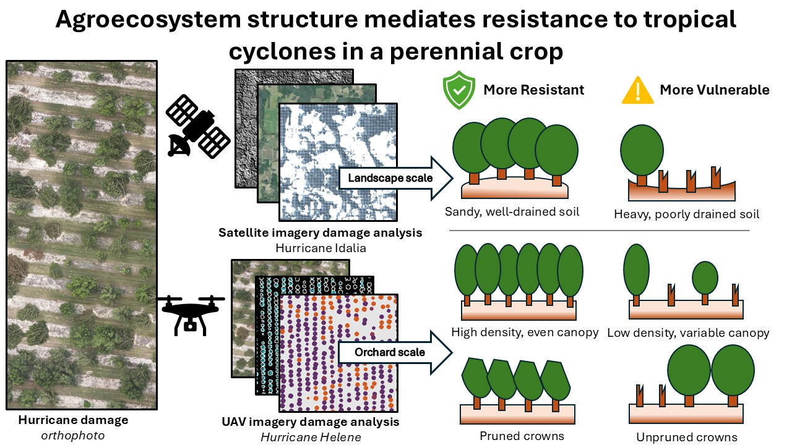

# Data and Code Repository

## Cannon et al. (2025) — Agroecosystem structure mediates vulnerability to intensifying tropical cyclones in a globally important perennial crop

submitted to *Global Change Biology*

---


---

## Overview

This repository contains the data and R analysis scripts supporting a multi-scale study of tropical cyclone damage to pecan (*Carya illinoinensis*) orchards in the southeastern United States. The study integrates satellite-based machine learning across a 53,000 km² area impacted by Hurricane Idalia (2023) with UAV stereophotogrammetry from nearly 16,000 individual trees impacted by Hurricane Helene (2024).

**What is shared:** Processed landscape-scale sample point data, processed individual tree data extracted from UAV imagery, hurricane track and wind field spatial data, and the R scripts used for statistical analysis and figure generation.

Processed data products derived from UAV stereophotogrammetry and satellite remote sensing are shared here and are sufficient to reproduce all statistical analyses and figures reported in the manuscript. However, raw UAV stereophotogrammetry imagery, raw satellite imagery, and individual orchard training plot data used to build remote sensing models are prohibitively large for public archiving and are withheld to protect landowner privacy. These data are not shared but available upon request.

<div align="center">
  
</div>

---

## Repository Structure

```
/
├── README.md
├── analysis/
│   ├── landscape-gam-analysis.R
│   └── orchard-gam-analysis.R
├── data/
│   ├── pecan-landscape-data.csv
│   ├── pecan-orchard-data.csv
│   ├── IDALIA.shp (+ .dbf, .prj, .shx)
│   ├── IDALIA.tif
│   ├── IDALIA_directions.tif
│   └── Idalia_HurricanePath_WithPoints.shp (+ .dbf, .prj, .shx, .cpg, .sbn, .sbx)
└── figs/
    ├── gam_output-landscape.csv
    ├── landscape-effects.jpg
    ├── landscape-effects-itx.jpg
    ├── orchard-effects.jpg
    ├── scale-sensitivity.jpg
    └── graphical-abstract.jpg
    
```

---

## Software Requirements

All analyses were conducted in R version 4.5.1. The following packages are required and are loaded at the top of each script:

**landscape-gam-analysis.R:** `googledrive`, `mgcv`, `gratia`, `tidyverse`, `ggplot2`, `ggpubr`, `terra`, `sf`, `corrplot`

**orchard-gam-analysis.R:** `tidyverse`, `mgcv`, `gratia`, `ggpubr`, `magrittr`, `corrplot`

---

## Data Files

### pecan-landscape-data.csv

Sample points used for the landscape-scale GAM analysis of Hurricane Idalia damage. The full dataset contains 1,868 points stratified across pecan orchards in Georgia and Florida; 1,453 points within 100 km of the hurricane track are retained for analysis by the script. Points represent 30 m pixels within orchard footprints identified from the USDA Cropland Data Layer. All coordinates are in WGS84.

| Column | Description |
|--------|-------------|
| `system:index` | Google Earth Engine sample point identifier |
| `.geo` | Point geometry in GeoJSON format (WGS84) |
| `severity` | Estimated canopy loss (0–1), calculated as the proportional decline in satellite-predicted canopy cover between pre-storm (summer 2023) and post-storm (summer 2024) imagery. Clamped to [0.01, 0.99] for beta regression |
| `idaliaMSW` | Maximum sustained wind speed (m/s) from Hurricane Idalia estimated using the HURRECON model at 15-minute intervals at ~17 km resolution |
| `ba2023` | Pre-storm orchard basal area (m² ha⁻¹) estimated from satellite imagery using random forest regression |
| `ca2023` | Pre-storm canopy cover (%) estimated from satellite imagery |
| `ca2024` | Post-storm canopy cover (%) estimated from satellite imagery |
| `qmd2023` | Pre-storm quadratic mean diameter (cm) estimated from satellite imagery |
| `elevation` | Elevation (m), from NASA SRTM 30 m DEM |
| `slope` | Slope (degrees), derived from NASA SRTM DEM |
| `aspect` | Aspect (degrees), derived from NASA SRTM DEM |
| `hillshade` | Hillshade index derived from NASA SRTM DEM |
| `mTPI` | Multi-scale topographic position index, averaged across five spatial scales (see tpi columns below) |
| `tpi001` | Topographic position index at 1-pixel radius |
| `tpi003` | Topographic position index at 3-pixel radius |
| `tpi009` | Topographic position index at 9-pixel radius |
| `tpi027` | Topographic position index at 27-pixel radius |
| `tpi081` | Topographic position index at 81-pixel radius |
| `topoDiversity` | Topographic diversity index |
| `windSpeedClass` | Categorical wind speed class from HURRECON model |
| `b0` | Percent sand content at 0 cm depth (OpenLandMap) |
| `b10` | Percent sand content at 10 cm depth |
| `b30` | Percent sand content at 30 cm depth |
| `b60` | Percent sand content at 60 cm depth |
| `b100` | Percent sand content at 100 cm depth |
| `b200` | Percent sand content at 200 cm depth; selected as optimal depth for analysis |
| `cover_[direction]_[scale]` | Proportion of tree cover within a 45° angular kernel centered on the specified cardinal/intercardinal direction (000=N, 045=NE, 090=E, 135=SE, 180=S, 225=SW, 270=W, 315=NW) at the specified pixel radius scale (01, 03, 05, 10, 30, 50, 100). Derived from NAIP imagery classification |
| `cover_[scale]` | Omnidirectional tree cover proportion at the specified pixel radius scale |

The script selects the upwind directional cover column matching the direction of maximum wind speed at each point (extracted from `IDALIA_directions.tif`) and constructs `upwindCover` variables at each scale.

---

### pecan-orchard-data.csv

Individual tree measurements extracted from UAV stereophotogrammetry (structure-from-motion point clouds) collected before and after Hurricane Helene (2024) across seven pecan orchards. Contains 15,820 trees across orchards coded GN, GS, H1, H2, H3, P, and W. Orchard identities are anonymized to protect landowner privacy.

| Column | Description |
|--------|-------------|
| `tree` | Tree identifier within orchard |
| `orchard` | Anonymized orchard identifier (GN, GS, H1, H2, H3, P, W) |
| `crown_area_m2` | Pre-storm crown area (m²) derived from UAV crown delineation |
| `ht_m` | Pre-storm tree height (m) from canopy height model |
| `pre_helene_vol` | Pre-storm canopy geometric volume (m³) calculated from canopy height model |
| `post_helene_vol` | Post-storm canopy geometric volume (m³) calculated from canopy height model |
| `damage` | Crown damage severity (%), calculated as the proportional loss in canopy geometric volume between pre- and post-storm point clouds. Clamped to (0.001, 0.999) for beta regression after dividing by 100 |
| `rel_ht` | Relative tree height: ratio of focal tree height to mean height of all trees within 20 m radius |
| `rel_dens_1.8ha` | Count of neighboring trees within a 20 m radius; converted to density (trees ha⁻¹) in the analysis script |
| `HELENE_MSW` | Maximum sustained wind speed (m/s) from Hurricane Helene estimated using the HURRECON model; range 29.94–33.08 m/s across the seven orchards |
| `predicted_dbh` | Predicted trunk diameter at breast height (cm) derived from allometric relationship with tree height |

---

## Spatial Data Files

### IDALIA.shp
Hurricane Idalia (2023) track points from the National Hurricane Center best-track dataset. CRS: WGS84.

| Field | Description |
|-------|-------------|
| `iso_time` | Date and time (UTC) |
| `lon` | Longitude (decimal degrees) |
| `lat` | Latitude (decimal degrees) |
| `msw` | Maximum sustained wind speed (knots) |
| `scale` | Saffir-Simpson hurricane wind scale category |
| `rmw` | Radius of maximum winds (nautical miles) |
| `pres` | Minimum central pressure (hPa) |
| `poci` | Pressure of outermost closed isobar (hPa) |

### Idalia_HurricanePath_WithPoints.shp
Single polyline feature representing the Hurricane Idalia track, derived from IDALIA.shp. Used in the analysis script to generate a 100 km buffer for clipping landscape sample points. CRS: WGS84.

### IDALIA.tif
Raster of modeled maximum sustained wind speed (m/s) across the study area during Hurricane Idalia, generated using the HURRECON model at approximately 17 km resolution. CRS: WGS84.

### IDALIA_directions.tif
Raster of wind direction (degrees) at the time of maximum sustained wind speed at each location during Hurricane Idalia, generated using the HURRECON model. Used in the analysis script to identify the upwind direction for each landscape sample point. CRS: WGS84.

---

## Analysis Scripts

### landscape-gam-analysis.R
Fits a generalized additive model (GAM) with beta regression family to predict landscape-scale canopy damage severity following Hurricane Idalia. Key steps:

1. Loads `data/pecan-landscape-data.csv` and clips to 100 km of the hurricane track
2. Extracts maximum wind direction at each point from `IDALIA_directions.tif`
3. Calculates topographic exposure index as a function of slope, aspect, and wind direction
4. Selects the optimal spatial scale for multi-scale variables (sand depth, TPI, upwind cover, omnidirectional cover) using AIC comparison across exploratory GAMs
5. Checks multicollinearity among predictors
6. Fits the final GAM with main effects and pairwise interactions with wind speed
7. Generates figures and model output tables saved to `/figs/`

**Outputs:** figs/`scale-sensitivity.jpg`, `figs/landscape-effects.jpg`, `figs/landscape-effects-itx.jpg`, `figs/gam_output-landscape.csv`

### orchard-gam-analysis.R
Fits a GAM with beta regression family and orchard random effects to predict individual tree crown damage severity following Hurricane Helene. Key steps:

1. Loads `data/pecan-orchard-data.csv` and prepares variables
2. Checks multicollinearity among size variables (height, crown area, predicted DBH are highly correlated; crown area is retained)
3. Fits the final GAM with crown area, relative height, and local density as predictors, with orchard as a random effect
4. Generates figures and model output tables saved to `/figs/`

**Outputs:** `figs/orchard-effects.jpg`, `figs/gam_output-orchard.csv`

---

## Notes on Data Provenance and Privacy

Raw UAV stereophotogrammetry imagery, satellite imagery, and orchard-level training plot data are not shared in this repository. Individual orchard identities are anonymized and orchard locations are withheld to protect landowner privacy, consistent with data sharing agreements. The processed data files provided here are sufficient to fully reproduce all statistical analyses and figures reported in the manuscript.

---

## Citation

Cannon, J.B. et al. (2025). Agroecosystem structure mediates vulnerability to intensifying tropical cyclones in a globally important perennial crop. *Global Change Biology* in review

---

## Contact

Jeffery Cannon, PhD
[jeffery.cannon@jonesctr.org](mailto: jeffery.cannon@jonesctr.org)
[Landscape Ecology Lab](https://lab.jonesctr.org/cannon/), Jones Center at Ichauway
